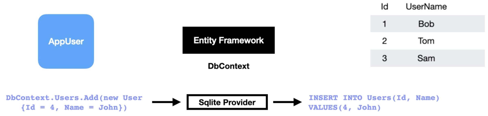

#### What is it?

Am Object Relation Mapper (ORM)

Translates our code into SQL commands that update our table in the database

### Entity Framework Features

- Querying
- Chagne Tacking
- Saving
- Concurrency
- Transactions
- Caching
- Built-in conventions
- Configurations
- Migrations

### Recap

This lecture provides a comprehensive introduction to Entity Framework, a key tool for application development that simplifies database interactions. Here’s a summary of the main points discussed:

What is Entity Framework?: It is an object-relational mapper (ORM) that automates the process of translating code into SQL commands for database updates. This is significant as it replaces the need for manual coding with ADO.NET, which was often cumbersome and error-prone.

DbContext Class: The lecture highlights the importance of the DbContext class, which acts as a bridge between application entities and the database. By deriving from this class, developers can easily manage database interactions using LINQ queries.

SQLite as Database Provider: For development, SQLite is recommended due to its portability and convenience, as it does not require a separate database server installation.

Key Features:

LINQ Queries: Allows for easy querying in C#.
Change Tracking: Automatically tracks changes in entities for saving to the database.
Save Changes Method: Handles insert, update, and delete commands.
Optimistic Concurrency: Protects against overwriting changes made by others.
Transaction Management: Manages transactions during data operations.
First-Level Caching: Enhances performance by caching query results.
Built-in Conventions: Automatically configures the database schema based on naming conventions.
Migrations: Facilitates database schema generation based on your code, simplifying management of changes.
The lecture concludes that while developers can choose to create a database first, using migrations for a code-first approach is typically more convenient and effective.

If you have any questions about Entity Framework or how to implement it in your project, feel free to ask!