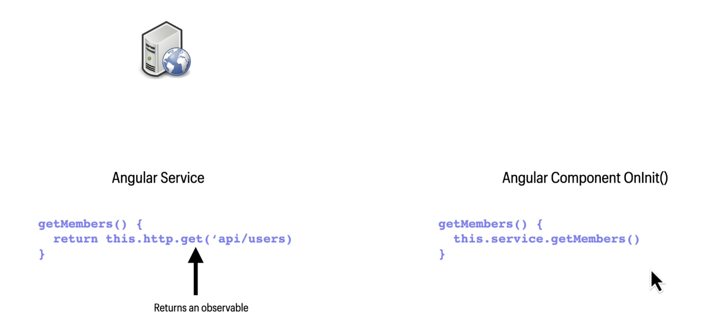
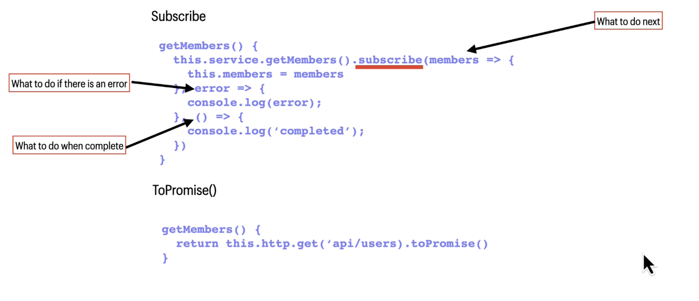

### OBSERVABLES & SINGNALS

#### **What are Observables?**

New standard for managing async data included in ES7 (ES2026)
Includeced in Angular V2
Observables are lazy collections of multiple values over time
You can thing of observables like a newsletter
- Only subscribers of newslatter receive the newsletter
- If no-one subscribes to the newslatter it propably will not be printed

####  **Promises vs Observables**

**Promise**

Provides a single future value
Not lazy
Can not cancel

**Observable**
Emits multiple values over time
Lazy
Able to cancel
Can use wthi map, filter, reduce and other operators

#### **Observables and  Angular**



#### **Observables and RxJS**


```js
getMembers() {
    return this.http.get(`api/users`).pipe(
        map(members => {
            console.log(member.id)
            return member.id
        })
    )
}
```

#### **Getting data from observables**



#### **Async Pipe**


```html
<i *ngFor=`let number of service.getMembers() | async`>{{member.username}}</>
```

**Automatically subscribes/unsubscribes from the Observable**


### Signals

A **signal** is a wrapper around a value that notifies interested consumers when that value changes.
Signals can contain any value, from primitives to complex data structures.

```js
const count = signal(0);
// Signals are getter functions - calling them reads their value.
console.log('This count is: ' + count());

// Set a new value
count.set(3)

// Update a value
count.update(value => value + 2)
```

#### Singals
- Simplicity and readability
- Performance
- Predictability
- Integration